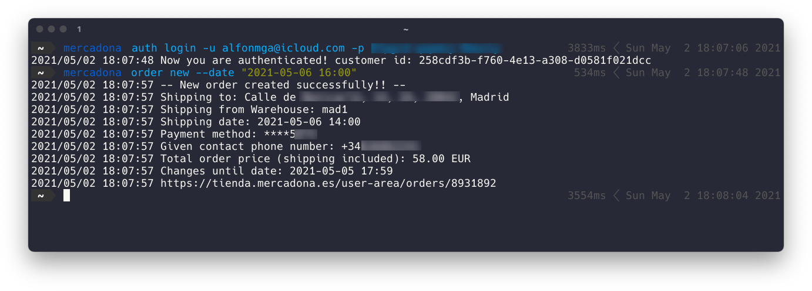

# mercadona-cli

> <https://tienda.mercadona.es>

```text
                               _                       ___   __   _____
  /\/\   ___ _ __ ___ __ _  __| | ___  _ __   __ _    / __\ / /   \_   \
 /    \ / _ \ '__/ __/ _` |/ _` |/ _ \| '_ \ / _` |  / /   / /     / /\/
/ /\/\ \  __/ | | (_| (_| | (_| | (_) | | | | (_| | / /___/ /___/\/ /_
\/    \/\___|_|  \___\__,_|\__,_|\___/|_| |_|\__,_| \____/\____/\____/

```

⚠️ EXPERIMENTAL CLI!! THERE COULD BE BUGS OR UNHANDLED SCENARIOS!! USE AT YOUR OWN RISK ⚠️

## Demo



- Authenticates into provided account
- Creates a new order of my most bought products up to min. required order price (50,00€) and sets shipping date to given `--date`.

## Features

- [x] Authentication
- [x] Show current account information
- [x] Make an order
- [x] Get URL to modify latest active order

## Build

```shell
$ git clone https://github.com/alfonmga/mercadona-cli
$ cd mercadona-cli/
$ make
```

## Usage

```shell
$ mercadona --help

Mercadona CLI

Usage:
  mercadona [command]

Available Commands:
  auth        Authentication
  help        Help about any command
  order       Manage orders

Flags:
  -h, --help   help for mercadona-cli

Use "mercadona [command] --help" for more information about a command.
```

## Mercadona API reverse engineering

### Set warehouse by postal code

```shell
$ echo '{"new_postal_code": "<postal_code>"}' | http PUT "https://tienda.mercadona.es/api/postal-codes/actions/change-pc/"

HTTP/1.1 200 OK
Allow: PUT, POST
Alt-Svc: clear
Cache-Control: no-cache
Cache-Control: no-cache
Content-Language: es
Content-Length: 27
Content-Type: application/json
Date: Wed, 28 Apr 2021 13:37:02 GMT
Expires: Wed, 28 Apr 2021 13:37:01 GMT
Server: nginx
Strict-Transport-Security: max-age=86400
Vary: Cookie, Origin
Via: 1.1 google
X-Frame-Options: SAMEORIGIN
X-Request-ID: ce8caac5e57e7bfd05410e699a9f9cce
X-SRE-header: location_only_api_nocache
x-customer-pc: <pc>
x-customer-wh: mad1

{
    "warehouse_changed": true
}
```

### Authenticate

```shell
 $ echo '{"username":"<email>","password": "<password>"}' | http POST "https://tienda.mercadona.es/api/auth/tokens/"

HTTP/1.1 200 OK
Allow: POST, OPTIONS
Alt-Svc: clear
Cache-Control: no-cache
Cache-Control: no-cache
Content-Encoding: gzip
Content-Language: es
Content-Type: application/json
Date: Wed, 28 Apr 2021 13:44:42 GMT
Expires: Wed, 28 Apr 2021 13:44:41 GMT
Server: nginx
Strict-Transport-Security: max-age=86400
Transfer-Encoding: chunked
Vary: Accept-Encoding
Vary: Origin
Via: 1.1 google
X-Frame-Options: SAMEORIGIN
X-Request-ID: dc1643fe8d0a13ec12a996853754c229
X-SRE-header: location_only_api_nocache
x-customer-pc: <pc>
x-customer-wh: mad1

{
    "access_token": "<access_token>",
    "customer_id": "<customer_id>"
}
```

### Get customer information

```shell
$ http GET "https://tienda.mercadona.es/api/customers/<customer_id>/" "Authorization:Bearer <auth_token>"

HTTP/1.1 200 OK
Allow: GET, PUT, PATCH, DELETE, HEAD, OPTIONS
Alt-Svc: clear
Cache-Control: no-cache
Cache-Control: no-cache
Content-Language: es
Content-Length: 242
Content-Type: application/json
Date: Wed, 28 Apr 2021 14:12:47 GMT
Expires: Wed, 28 Apr 2021 14:12:46 GMT
Server: nginx
Strict-Transport-Security: max-age=86400
Vary: Origin
Via: 1.1 google
X-Frame-Options: SAMEORIGIN
X-Request-ID: 41afc2e37f33b20810a1abe2d0ffee85
X-SRE-header: location_only_api_nocache
x-customer-pc: <pc>
x-customer-wh: mad1

{
    "cart_id": "<cart_id>",
    "current_postal_code": "<postal_code>",
    "email": "<email>",
    "id": <id>,
    "last_name": "<last_name>",
    "name": "<name>",
    "send_offers": false,
    "uuid": "<uuid>"
}
```

### Get customer cart

```shell
$ http GET "https://tienda.mercadona.es/api/customers/<customer_id>/cart/" "Authorization:Bearer <auth_token>"

HTTP/1.1 200 OK
Allow: GET, PUT, HEAD, OPTIONS
Alt-Svc: clear
Cache-Control: no-cache
Cache-Control: no-cache
Content-Language: es
Content-Length: 138
Content-Type: application/json
Date: Wed, 28 Apr 2021 14:23:15 GMT
Expires: Wed, 28 Apr 2021 14:23:14 GMT
Server: nginx
Strict-Transport-Security: max-age=86400
Vary: Origin
Via: 1.1 google
X-Frame-Options: SAMEORIGIN
X-Request-ID: 6271d00c1fdf045a2f919118714eac6a
X-SRE-header: location_only_api_nocache
x-customer-pc: <pc>
x-customer-wh: mad1

{
    "id": "<cart_id>",
    "lines": [],
    "open_order_id": <open_order_id>,
    "products_count": 0,
    "summary": {
        "total": "0.00"
    },
    "version": 3
}
```

### Add products to cart

```shell
$ echo '{"id":"<cart_id>","version":1,"lines":[{"quantity":6,"product_id":"51621","sources":[]}]}' | http PUT "https://tienda.mercadona.es/api/customers/<customer_id>/cart/" "Authorization:Bearer <auth_token>"
HTTP/1.1 200 OK
Allow: GET, PUT, HEAD, OPTIONS
Alt-Svc: clear
Cache-Control: no-cache
Cache-Control: no-cache
Content-Encoding: gzip
Content-Language: es
Content-Type: application/json
Date: Sun, 02 May 2021 10:12:19 GMT
Expires: Sun, 02 May 2021 10:12:18 GMT
Server: nginx
Strict-Transport-Security: max-age=86400
Transfer-Encoding: chunked
Vary: Accept-Encoding
Vary: Origin
Via: 1.1 google
X-Frame-Options: SAMEORIGIN
X-Request-ID: 8f52e532fa98b2449c96fa953ec7926d
X-SRE-header: location_only_api_nocache
x-customer-pc: <pc>
x-customer-wh: mad1

{
    "id": "<cart_id>",
    "lines": [
        {
            "product": {
                "badges": {
                    "is_water": false,
                    "requires_age_check": false
                },
                "categories": [
                    {
                        "id": 4,
                        "level": 0,
                        "name": "Charcutería y quesos",
                        "order": 159
                    }
                ],
                "display_name": "Queso camembert Marcillat",
                "id": "51621",
                "limit": 999,
                "packaging": "Caja",
                "price_instructions": {
                    "approx_size": false,
                    "bulk_price": "5.21",
                    "bunch_selector": false,
                    "drained_weight": null,
                    "increment_bunch_amount": 1.0,
                    "is_new": false,
                    "is_pack": false,
                    "iva": 4,
                    "min_bunch_amount": 1.0,
                    "pack_size": null,
                    "price_decreased": false,
                    "reference_format": "kg",
                    "reference_price": "5.21",
                    "selling_method": 0,
                    "size_format": "kg",
                    "total_units": null,
                    "unit_name": null,
                    "unit_price": "1.25",
                    "unit_selector": true,
                    "unit_size": 0.24
                },
                "published": true,
                "share_url": "https://tienda.mercadona.es/product/51621/queso-camembert-marcillat-caja",
                "slug": "queso-camembert-marcillat-caja",
                "thumbnail": "https://prod-mercadona.imgix.net/images/5fb62b31682755ff434f9273a0717ba2.jpg?fit=crop&h=300&w=300"
            },
            "quantity": 6.0,
            "sources": [
                "+RP",
            ],
            "version": 5
        }
    ],
    "open_order_id": null,
    "products_count": 1,
    "summary": {
        "total": "7.50"
    },
    "version": 5
}
```

### Checkout cart

```shell
$ echo '{"cart":{"id": "<cart_id>", "version": 25, "lines": [{"quantity": 1, "version": 25, "product_id": "66463", "sources": []}]}}' | http POST "https://tienda.mercadona.es/api/customers/<customer_id>/checkouts/" "Authorization:Bearer <auth_token>"

HTTP/1.1 201 Created
Allow: POST, OPTIONS
Alt-Svc: clear
Cache-Control: no-cache
Cache-Control: no-cache
Content-Language: es
Content-Length: 2005
Content-Type: application/json
Date: Sun, 02 May 2021 12:50:15 GMT
Expires: Sun, 02 May 2021 12:50:14 GMT
Server: nginx
Strict-Transport-Security: max-age=86400
Vary: Origin
Via: 1.1 google
X-Frame-Options: SAMEORIGIN
X-Request-ID: d6d0827354830fb1906943e18b90068a
X-SRE-header: location_only_api_nocache
x-customer-pc: <pc>
x-customer-wh: mad1

{
    "address": {
        "address": "<address>",
        "address_detail": "<address_detail>",
        "comments": "<comments>",
        "entered_manually": false,
        "id": <id>,
        "latitude": "<lat>",
        "longitude": "<long>",
        "permanent_address": true,
        "postal_code": "<postal_code>",
        "town": "Madrid"
    },
    "authentication_type": "sca",
    "cart": {
        "id": "<cart_id>",
        "lines": [
            {
                "id": 0,
                "original_price_instructions": null,
                "product": {
                    "badges": {
                        "is_water": false,
                        "requires_age_check": true
                    },
                    "categories": [
                        {
                            "id": 19,
                            "level": 0,
                            "name": "Bodega",
                            "order": 15
                        }
                    ],
                    "display_name": "Cerveza Clásica Steinburg",
                    "id": "66463",
                    "limit": 999,
                    "packaging": "Lata",
                    "price_instructions": {
                        "approx_size": false,
                        "bulk_price": "0.70",
                        "bunch_selector": false,
                        "drained_weight": null,
                        "increment_bunch_amount": 1.0,
                        "is_new": false,
                        "is_pack": false,
                        "iva": 21,
                        "min_bunch_amount": 1.0,
                        "pack_size": null,
                        "price_decreased": false,
                        "reference_format": "L",
                        "reference_price": "0.70",
                        "selling_method": 0,
                        "size_format": "l",
                        "total_units": null,
                        "unit_name": null,
                        "unit_price": "0.23",
                        "unit_selector": true,
                        "unit_size": 0.33
                    },
                    "published": true,
                    "share_url": "https://tienda.mercadona.es/product/66463/cerveza-clasica-steinburg-lata",
                    "slug": "cerveza-clasica-steinburg-lata",
                    "thumbnail": "https://prod-mercadona.imgix.net/images/06f788943946c4dbf1b25ba623a5727e.jpg?fit=crop&h=300&w=300"
                },
                "product_id": "66463",
                "quantity": 4.0,
                "sources": []
            }
        ]
    },
    "click_and_collect": false,
    "click_and_collect_available": false,
    "customer_phone": "+34636862241",
    "id": <id>,
    "order_id": null,
    "payment_method": {
        "credit_card_number": "<credit_card_number>",
        "credit_card_type": 1,
        "default_card": true,
        "expiration_status": "valid",
        "expires_month": "<expires_month>",
        "expires_year": "<expires_year>",
        "id": <id>
    },
    "phone_country_code": "34",
    "phone_national_number": "<phone_national_number>",
    "price": "0.92",
    "requires_address_confirmation": false,
    "requires_age_check": true,
    "slot": null,
    "slot_size": 1,
    "summary": {
        "products": "0.92",
        "slot": "0.00",
        "tax_base": "0.76",
        "taxes": "0.16",
        "total": "0.92",
        "volume_extra_cost": {
            "cost_by_extra_liter": "0.1",
            "threshold": 70,
            "total": "0.00",
            "total_extra_liters": 0.0
        }
    }
}
```

### List address slots

```shell
$ http GET "https://tienda.mercadona.es/api/customers/<customer_id>/addresses/<address_id>/slots/" "Authorization:Bearer <auth_token>"

HTTP/1.1 200 OK
Allow: GET, HEAD, OPTIONS
Alt-Svc: clear
Cache-Control: no-cache
Cache-Control: no-cache
Content-Encoding: gzip
Content-Language: es
Content-Type: application/json
Date: Sun, 02 May 2021 13:18:21 GMT
Expires: Sun, 02 May 2021 13:18:20 GMT
Server: nginx
Strict-Transport-Security: max-age=86400
Transfer-Encoding: chunked
Vary: Accept-Encoding
Vary: Origin
Via: 1.1 google
X-Frame-Options: SAMEORIGIN
X-Request-ID: e39c9621641025c2ecce56a064fe1b63
X-SRE-header: location_only_api_nocache
x-customer-pc: <pc>
x-customer-wh: mad1

{
    "next_page": null,
    "results": [
        {
            "available": false,
            "end": "2021-05-03T06:00:00Z",
            "id": "125310",
            "open": true,
            "price": "7.21",
            "start": "2021-05-03T05:00:00Z"
        },
        {
            "available": false,
            "end": "2021-05-03T07:00:00Z",
            "id": "125309",
            "open": true,
            "price": "7.21",
            "start": "2021-05-03T06:00:00Z"
        },
        {
            "available": false,
            "end": "2021-05-03T08:00:00Z",
            "id": "125308",
            "open": true,
            "price": "7.21",
            "start": "2021-05-03T07:00:00Z"
        },
        {
            "available": false,
            "end": "2021-05-03T09:00:00Z",
            "id": "125307",
            "open": true,
            "price": "7.21",
            "start": "2021-05-03T08:00:00Z"
        },
        {
            "available": false,
            "end": "2021-05-03T10:00:00Z",
            "id": "125306",
            "open": true,
            "price": "7.21",
            "start": "2021-05-03T09:00:00Z"
        },
        {
            "available": false,
            "end": "2021-05-03T11:00:00Z",
            "id": "125305",
            "open": true,
            "price": "7.21",
            "start": "2021-05-03T10:00:00Z"
        },
        {
            "available": false,
            "end": "2021-05-03T12:00:00Z",
            "id": "125304",
            "open": true,
            "price": "7.21",
            "start": "2021-05-03T11:00:00Z"
        },
        {
            "available": false,
            "end": "2021-05-03T13:00:00Z",
            "id": "125303",
            "open": true,
            "price": "7.21",
            "start": "2021-05-03T12:00:00Z"
        },
        {
            "available": false,
            "end": "2021-05-03T14:00:00Z",
            "id": "125302",
            "open": true,
            "price": "7.21",
            "start": "2021-05-03T13:00:00Z"
        },
        {
            "available": false,
            "end": "2021-05-03T15:00:00Z",
            "id": "125301",
            "open": true,
            "price": "7.21",
            "start": "2021-05-03T14:00:00Z"
        },
        {
            "available": false,
            "end": "2021-05-03T16:00:00Z",
            "id": "125300",
            "open": true,
            "price": "7.21",
            "start": "2021-05-03T15:00:00Z"
        },
        {
            "available": false,
            "end": "2021-05-03T17:00:00Z",
            "id": "125299",
            "open": true,
            "price": "7.21",
            "start": "2021-05-03T16:00:00Z"
        },
        {
            "available": false,
            "end": "2021-05-03T18:00:00Z",
            "id": "125298",
            "open": true,
            "price": "7.21",
            "start": "2021-05-03T17:00:00Z"
        },
        {
            "available": false,
            "end": "2021-05-03T19:00:00Z",
            "id": "125297",
            "open": true,
            "price": "7.21",
            "start": "2021-05-03T18:00:00Z"
        },
        {
            "available": false,
            "end": "2021-05-03T20:00:00Z",
            "id": "125296",
            "open": true,
            "price": "7.21",
            "start": "2021-05-03T19:00:00Z"
        },
        {
            "available": false,
            "end": "2021-05-04T06:00:00Z",
            "id": "125494",
            "open": true,
            "price": "7.21",
            "start": "2021-05-04T05:00:00Z"
        },
        {
            "available": false,
            "end": "2021-05-04T07:00:00Z",
            "id": "125493",
            "open": true,
            "price": "7.21",
            "start": "2021-05-04T06:00:00Z"
        },
        {
            "available": false,
            "end": "2021-05-04T08:00:00Z",
            "id": "125492",
            "open": true,
            "price": "7.21",
            "start": "2021-05-04T07:00:00Z"
        },
        {
            "available": false,
            "end": "2021-05-04T09:00:00Z",
            "id": "125491",
            "open": true,
            "price": "7.21",
            "start": "2021-05-04T08:00:00Z"
        },
        {
            "available": false,
            "end": "2021-05-04T10:00:00Z",
            "id": "125490",
            "open": true,
            "price": "7.21",
            "start": "2021-05-04T09:00:00Z"
        },
        {
            "available": false,
            "end": "2021-05-04T11:00:00Z",
            "id": "125489",
            "open": true,
            "price": "7.21",
            "start": "2021-05-04T10:00:00Z"
        },
        {
            "available": false,
            "end": "2021-05-04T12:00:00Z",
            "id": "125488",
            "open": true,
            "price": "7.21",
            "start": "2021-05-04T11:00:00Z"
        },
        {
            "available": false,
            "end": "2021-05-04T13:00:00Z",
            "id": "125487",
            "open": true,
            "price": "7.21",
            "start": "2021-05-04T12:00:00Z"
        },
        {
            "available": false,
            "end": "2021-05-04T14:00:00Z",
            "id": "125486",
            "open": true,
            "price": "7.21",
            "start": "2021-05-04T13:00:00Z"
        },
        {
            "available": false,
            "end": "2021-05-04T15:00:00Z",
            "id": "125485",
            "open": true,
            "price": "7.21",
            "start": "2021-05-04T14:00:00Z"
        },
        {
            "available": false,
            "end": "2021-05-04T16:00:00Z",
            "id": "125484",
            "open": true,
            "price": "7.21",
            "start": "2021-05-04T15:00:00Z"
        },
        {
            "available": false,
            "end": "2021-05-04T17:00:00Z",
            "id": "125483",
            "open": true,
            "price": "7.21",
            "start": "2021-05-04T16:00:00Z"
        },
        {
            "available": false,
            "end": "2021-05-04T18:00:00Z",
            "id": "125482",
            "open": true,
            "price": "7.21",
            "start": "2021-05-04T17:00:00Z"
        },
        {
            "available": false,
            "end": "2021-05-04T19:00:00Z",
            "id": "125481",
            "open": true,
            "price": "7.21",
            "start": "2021-05-04T18:00:00Z"
        },
        {
            "available": false,
            "end": "2021-05-04T20:00:00Z",
            "id": "125480",
            "open": true,
            "price": "7.21",
            "start": "2021-05-04T19:00:00Z"
        },
        {
            "available": true,
            "end": "2021-05-05T06:00:00Z",
            "id": "125678",
            "open": true,
            "price": "7.21",
            "start": "2021-05-05T05:00:00Z"
        },
        {
            "available": true,
            "end": "2021-05-05T07:00:00Z",
            "id": "125677",
            "open": true,
            "price": "7.21",
            "start": "2021-05-05T06:00:00Z"
        },
        {
            "available": true,
            "end": "2021-05-05T08:00:00Z",
            "id": "125676",
            "open": true,
            "price": "7.21",
            "start": "2021-05-05T07:00:00Z"
        },
        {
            "available": false,
            "end": "2021-05-05T09:00:00Z",
            "id": "125675",
            "open": true,
            "price": "7.21",
            "start": "2021-05-05T08:00:00Z"
        },
        {
            "available": true,
            "end": "2021-05-05T10:00:00Z",
            "id": "125674",
            "open": true,
            "price": "7.21",
            "start": "2021-05-05T09:00:00Z"
        },
        {
            "available": true,
            "end": "2021-05-05T11:00:00Z",
            "id": "125673",
            "open": true,
            "price": "7.21",
            "start": "2021-05-05T10:00:00Z"
        },
        {
            "available": true,
            "end": "2021-05-05T12:00:00Z",
            "id": "125672",
            "open": true,
            "price": "7.21",
            "start": "2021-05-05T11:00:00Z"
        },
        {
            "available": true,
            "end": "2021-05-05T13:00:00Z",
            "id": "125671",
            "open": true,
            "price": "7.21",
            "start": "2021-05-05T12:00:00Z"
        },
        {
            "available": true,
            "end": "2021-05-05T14:00:00Z",
            "id": "125670",
            "open": true,
            "price": "7.21",
            "start": "2021-05-05T13:00:00Z"
        },
        {
            "available": true,
            "end": "2021-05-05T15:00:00Z",
            "id": "125669",
            "open": true,
            "price": "7.21",
            "start": "2021-05-05T14:00:00Z"
        },
        {
            "available": true,
            "end": "2021-05-05T16:00:00Z",
            "id": "125668",
            "open": true,
            "price": "7.21",
            "start": "2021-05-05T15:00:00Z"
        },
        {
            "available": true,
            "end": "2021-05-05T17:00:00Z",
            "id": "125667",
            "open": true,
            "price": "7.21",
            "start": "2021-05-05T16:00:00Z"
        },
        {
            "available": true,
            "end": "2021-05-05T18:00:00Z",
            "id": "125666",
            "open": true,
            "price": "7.21",
            "start": "2021-05-05T17:00:00Z"
        },
        {
            "available": true,
            "end": "2021-05-05T19:00:00Z",
            "id": "125665",
            "open": true,
            "price": "7.21",
            "start": "2021-05-05T18:00:00Z"
        },
        {
            "available": true,
            "end": "2021-05-05T20:00:00Z",
            "id": "125664",
            "open": true,
            "price": "7.21",
            "start": "2021-05-05T19:00:00Z"
        },
        {
            "available": true,
            "end": "2021-05-06T06:00:00Z",
            "id": "125862",
            "open": true,
            "price": "7.21",
            "start": "2021-05-06T05:00:00Z"
        },
        {
            "available": true,
            "end": "2021-05-06T07:00:00Z",
            "id": "125861",
            "open": true,
            "price": "7.21",
            "start": "2021-05-06T06:00:00Z"
        },
        {
            "available": true,
            "end": "2021-05-06T08:00:00Z",
            "id": "125860",
            "open": true,
            "price": "7.21",
            "start": "2021-05-06T07:00:00Z"
        },
        {
            "available": true,
            "end": "2021-05-06T09:00:00Z",
            "id": "125859",
            "open": true,
            "price": "7.21",
            "start": "2021-05-06T08:00:00Z"
        },
        {
            "available": true,
            "end": "2021-05-06T10:00:00Z",
            "id": "125858",
            "open": true,
            "price": "7.21",
            "start": "2021-05-06T09:00:00Z"
        },
        {
            "available": true,
            "end": "2021-05-06T11:00:00Z",
            "id": "125857",
            "open": true,
            "price": "7.21",
            "start": "2021-05-06T10:00:00Z"
        },
        {
            "available": true,
            "end": "2021-05-06T12:00:00Z",
            "id": "125856",
            "open": true,
            "price": "7.21",
            "start": "2021-05-06T11:00:00Z"
        },
        {
            "available": true,
            "end": "2021-05-06T13:00:00Z",
            "id": "125855",
            "open": true,
            "price": "7.21",
            "start": "2021-05-06T12:00:00Z"
        },
        {
            "available": true,
            "end": "2021-05-06T14:00:00Z",
            "id": "125854",
            "open": true,
            "price": "7.21",
            "start": "2021-05-06T13:00:00Z"
        },
        {
            "available": true,
            "end": "2021-05-06T15:00:00Z",
            "id": "125853",
            "open": true,
            "price": "7.21",
            "start": "2021-05-06T14:00:00Z"
        },
        {
            "available": true,
            "end": "2021-05-06T16:00:00Z",
            "id": "125852",
            "open": true,
            "price": "7.21",
            "start": "2021-05-06T15:00:00Z"
        },
        {
            "available": true,
            "end": "2021-05-06T17:00:00Z",
            "id": "125851",
            "open": true,
            "price": "7.21",
            "start": "2021-05-06T16:00:00Z"
        },
        {
            "available": true,
            "end": "2021-05-06T18:00:00Z",
            "id": "125850",
            "open": true,
            "price": "7.21",
            "start": "2021-05-06T17:00:00Z"
        },
        {
            "available": true,
            "end": "2021-05-06T19:00:00Z",
            "id": "125849",
            "open": true,
            "price": "7.21",
            "start": "2021-05-06T18:00:00Z"
        },
        {
            "available": true,
            "end": "2021-05-06T20:00:00Z",
            "id": "125848",
            "open": true,
            "price": "7.21",
            "start": "2021-05-06T19:00:00Z"
        },
        {
            "available": true,
            "end": "2021-05-07T06:00:00Z",
            "id": "126046",
            "open": true,
            "price": "7.21",
            "start": "2021-05-07T05:00:00Z"
        },
        {
            "available": true,
            "end": "2021-05-07T07:00:00Z",
            "id": "126045",
            "open": true,
            "price": "7.21",
            "start": "2021-05-07T06:00:00Z"
        },
        {
            "available": true,
            "end": "2021-05-07T08:00:00Z",
            "id": "126044",
            "open": true,
            "price": "7.21",
            "start": "2021-05-07T07:00:00Z"
        },
        {
            "available": true,
            "end": "2021-05-07T09:00:00Z",
            "id": "126043",
            "open": true,
            "price": "7.21",
            "start": "2021-05-07T08:00:00Z"
        },
        {
            "available": true,
            "end": "2021-05-07T10:00:00Z",
            "id": "126042",
            "open": true,
            "price": "7.21",
            "start": "2021-05-07T09:00:00Z"
        },
        {
            "available": true,
            "end": "2021-05-07T11:00:00Z",
            "id": "126041",
            "open": true,
            "price": "7.21",
            "start": "2021-05-07T10:00:00Z"
        },
        {
            "available": true,
            "end": "2021-05-07T12:00:00Z",
            "id": "126040",
            "open": true,
            "price": "7.21",
            "start": "2021-05-07T11:00:00Z"
        },
        {
            "available": true,
            "end": "2021-05-07T13:00:00Z",
            "id": "126039",
            "open": true,
            "price": "7.21",
            "start": "2021-05-07T12:00:00Z"
        },
        {
            "available": true,
            "end": "2021-05-07T14:00:00Z",
            "id": "126038",
            "open": true,
            "price": "7.21",
            "start": "2021-05-07T13:00:00Z"
        },
        {
            "available": true,
            "end": "2021-05-07T15:00:00Z",
            "id": "126037",
            "open": true,
            "price": "7.21",
            "start": "2021-05-07T14:00:00Z"
        },
        {
            "available": true,
            "end": "2021-05-07T16:00:00Z",
            "id": "126036",
            "open": true,
            "price": "7.21",
            "start": "2021-05-07T15:00:00Z"
        },
        {
            "available": true,
            "end": "2021-05-07T17:00:00Z",
            "id": "126035",
            "open": true,
            "price": "7.21",
            "start": "2021-05-07T16:00:00Z"
        },
        {
            "available": true,
            "end": "2021-05-07T18:00:00Z",
            "id": "126034",
            "open": true,
            "price": "7.21",
            "start": "2021-05-07T17:00:00Z"
        },
        {
            "available": true,
            "end": "2021-05-07T19:00:00Z",
            "id": "126033",
            "open": true,
            "price": "7.21",
            "start": "2021-05-07T18:00:00Z"
        },
        {
            "available": true,
            "end": "2021-05-07T20:00:00Z",
            "id": "126032",
            "open": true,
            "price": "7.21",
            "start": "2021-05-07T19:00:00Z"
        },
        {
            "available": true,
            "end": "2021-05-08T06:00:00Z",
            "id": "126230",
            "open": true,
            "price": "7.21",
            "start": "2021-05-08T05:00:00Z"
        },
        {
            "available": true,
            "end": "2021-05-08T07:00:00Z",
            "id": "126229",
            "open": true,
            "price": "7.21",
            "start": "2021-05-08T06:00:00Z"
        },
        {
            "available": true,
            "end": "2021-05-08T08:00:00Z",
            "id": "126228",
            "open": true,
            "price": "7.21",
            "start": "2021-05-08T07:00:00Z"
        },
        {
            "available": true,
            "end": "2021-05-08T09:00:00Z",
            "id": "126227",
            "open": true,
            "price": "7.21",
            "start": "2021-05-08T08:00:00Z"
        },
        {
            "available": true,
            "end": "2021-05-08T10:00:00Z",
            "id": "126226",
            "open": true,
            "price": "7.21",
            "start": "2021-05-08T09:00:00Z"
        },
        {
            "available": true,
            "end": "2021-05-08T11:00:00Z",
            "id": "126225",
            "open": true,
            "price": "7.21",
            "start": "2021-05-08T10:00:00Z"
        },
        {
            "available": true,
            "end": "2021-05-08T12:00:00Z",
            "id": "126224",
            "open": true,
            "price": "7.21",
            "start": "2021-05-08T11:00:00Z"
        },
        {
            "available": true,
            "end": "2021-05-08T13:00:00Z",
            "id": "126223",
            "open": true,
            "price": "7.21",
            "start": "2021-05-08T12:00:00Z"
        },
        {
            "available": true,
            "end": "2021-05-08T14:00:00Z",
            "id": "126222",
            "open": true,
            "price": "7.21",
            "start": "2021-05-08T13:00:00Z"
        },
        {
            "available": true,
            "end": "2021-05-08T15:00:00Z",
            "id": "126221",
            "open": true,
            "price": "7.21",
            "start": "2021-05-08T14:00:00Z"
        },
        {
            "available": true,
            "end": "2021-05-08T16:00:00Z",
            "id": "126220",
            "open": true,
            "price": "7.21",
            "start": "2021-05-08T15:00:00Z"
        },
        {
            "available": true,
            "end": "2021-05-08T17:00:00Z",
            "id": "126219",
            "open": true,
            "price": "7.21",
            "start": "2021-05-08T16:00:00Z"
        },
        {
            "available": true,
            "end": "2021-05-08T18:00:00Z",
            "id": "126218",
            "open": true,
            "price": "7.21",
            "start": "2021-05-08T17:00:00Z"
        },
        {
            "available": true,
            "end": "2021-05-08T19:00:00Z",
            "id": "126217",
            "open": true,
            "price": "7.21",
            "start": "2021-05-08T18:00:00Z"
        },
        {
            "available": true,
            "end": "2021-05-08T20:00:00Z",
            "id": "126216",
            "open": true,
            "price": "7.21",
            "start": "2021-05-08T19:00:00Z"
        },
        {
            "available": true,
            "end": "2021-05-10T06:00:00Z",
            "id": "126414",
            "open": true,
            "price": "7.21",
            "start": "2021-05-10T05:00:00Z"
        },
        {
            "available": true,
            "end": "2021-05-10T07:00:00Z",
            "id": "126413",
            "open": true,
            "price": "7.21",
            "start": "2021-05-10T06:00:00Z"
        },
        {
            "available": true,
            "end": "2021-05-10T08:00:00Z",
            "id": "126412",
            "open": true,
            "price": "7.21",
            "start": "2021-05-10T07:00:00Z"
        },
        {
            "available": true,
            "end": "2021-05-10T09:00:00Z",
            "id": "126411",
            "open": true,
            "price": "7.21",
            "start": "2021-05-10T08:00:00Z"
        },
        {
            "available": true,
            "end": "2021-05-10T10:00:00Z",
            "id": "126410",
            "open": true,
            "price": "7.21",
            "start": "2021-05-10T09:00:00Z"
        },
        {
            "available": true,
            "end": "2021-05-10T11:00:00Z",
            "id": "126409",
            "open": true,
            "price": "7.21",
            "start": "2021-05-10T10:00:00Z"
        },
        {
            "available": true,
            "end": "2021-05-10T12:00:00Z",
            "id": "126408",
            "open": true,
            "price": "7.21",
            "start": "2021-05-10T11:00:00Z"
        },
        {
            "available": true,
            "end": "2021-05-10T13:00:00Z",
            "id": "126407",
            "open": true,
            "price": "7.21",
            "start": "2021-05-10T12:00:00Z"
        },
        {
            "available": true,
            "end": "2021-05-10T14:00:00Z",
            "id": "126406",
            "open": true,
            "price": "7.21",
            "start": "2021-05-10T13:00:00Z"
        },
        {
            "available": true,
            "end": "2021-05-10T15:00:00Z",
            "id": "126405",
            "open": true,
            "price": "7.21",
            "start": "2021-05-10T14:00:00Z"
        },
        {
            "available": true,
            "end": "2021-05-10T16:00:00Z",
            "id": "126404",
            "open": true,
            "price": "7.21",
            "start": "2021-05-10T15:00:00Z"
        },
        {
            "available": true,
            "end": "2021-05-10T17:00:00Z",
            "id": "126403",
            "open": true,
            "price": "7.21",
            "start": "2021-05-10T16:00:00Z"
        },
        {
            "available": true,
            "end": "2021-05-10T18:00:00Z",
            "id": "126402",
            "open": true,
            "price": "7.21",
            "start": "2021-05-10T17:00:00Z"
        },
        {
            "available": true,
            "end": "2021-05-10T19:00:00Z",
            "id": "126401",
            "open": true,
            "price": "7.21",
            "start": "2021-05-10T18:00:00Z"
        },
        {
            "available": true,
            "end": "2021-05-10T20:00:00Z",
            "id": "126400",
            "open": true,
            "price": "7.21",
            "start": "2021-05-10T19:00:00Z"
        },
        {
            "available": true,
            "end": "2021-05-11T06:00:00Z",
            "id": "126598",
            "open": true,
            "price": "7.21",
            "start": "2021-05-11T05:00:00Z"
        },
        {
            "available": true,
            "end": "2021-05-11T07:00:00Z",
            "id": "126597",
            "open": true,
            "price": "7.21",
            "start": "2021-05-11T06:00:00Z"
        },
        {
            "available": true,
            "end": "2021-05-11T08:00:00Z",
            "id": "126596",
            "open": true,
            "price": "7.21",
            "start": "2021-05-11T07:00:00Z"
        },
        {
            "available": true,
            "end": "2021-05-11T09:00:00Z",
            "id": "126595",
            "open": true,
            "price": "7.21",
            "start": "2021-05-11T08:00:00Z"
        },
        {
            "available": true,
            "end": "2021-05-11T10:00:00Z",
            "id": "126594",
            "open": true,
            "price": "7.21",
            "start": "2021-05-11T09:00:00Z"
        },
        {
            "available": true,
            "end": "2021-05-11T11:00:00Z",
            "id": "126593",
            "open": true,
            "price": "7.21",
            "start": "2021-05-11T10:00:00Z"
        },
        {
            "available": true,
            "end": "2021-05-11T12:00:00Z",
            "id": "126592",
            "open": true,
            "price": "7.21",
            "start": "2021-05-11T11:00:00Z"
        },
        {
            "available": true,
            "end": "2021-05-11T13:00:00Z",
            "id": "126591",
            "open": true,
            "price": "7.21",
            "start": "2021-05-11T12:00:00Z"
        },
        {
            "available": true,
            "end": "2021-05-11T14:00:00Z",
            "id": "126590",
            "open": true,
            "price": "7.21",
            "start": "2021-05-11T13:00:00Z"
        },
        {
            "available": true,
            "end": "2021-05-11T15:00:00Z",
            "id": "126589",
            "open": true,
            "price": "7.21",
            "start": "2021-05-11T14:00:00Z"
        },
        {
            "available": true,
            "end": "2021-05-11T16:00:00Z",
            "id": "126588",
            "open": true,
            "price": "7.21",
            "start": "2021-05-11T15:00:00Z"
        },
        {
            "available": true,
            "end": "2021-05-11T17:00:00Z",
            "id": "126587",
            "open": true,
            "price": "7.21",
            "start": "2021-05-11T16:00:00Z"
        },
        {
            "available": true,
            "end": "2021-05-11T18:00:00Z",
            "id": "126586",
            "open": true,
            "price": "7.21",
            "start": "2021-05-11T17:00:00Z"
        },
        {
            "available": true,
            "end": "2021-05-11T19:00:00Z",
            "id": "126585",
            "open": true,
            "price": "7.21",
            "start": "2021-05-11T18:00:00Z"
        },
        {
            "available": true,
            "end": "2021-05-11T20:00:00Z",
            "id": "126584",
            "open": true,
            "price": "7.21",
            "start": "2021-05-11T19:00:00Z"
        },
        {
            "available": true,
            "end": "2021-05-12T06:00:00Z",
            "id": "126782",
            "open": true,
            "price": "7.21",
            "start": "2021-05-12T05:00:00Z"
        },
        {
            "available": true,
            "end": "2021-05-12T07:00:00Z",
            "id": "126781",
            "open": true,
            "price": "7.21",
            "start": "2021-05-12T06:00:00Z"
        },
        {
            "available": true,
            "end": "2021-05-12T08:00:00Z",
            "id": "126780",
            "open": true,
            "price": "7.21",
            "start": "2021-05-12T07:00:00Z"
        },
        {
            "available": true,
            "end": "2021-05-12T09:00:00Z",
            "id": "126779",
            "open": true,
            "price": "7.21",
            "start": "2021-05-12T08:00:00Z"
        },
        {
            "available": true,
            "end": "2021-05-12T10:00:00Z",
            "id": "126778",
            "open": true,
            "price": "7.21",
            "start": "2021-05-12T09:00:00Z"
        },
        {
            "available": true,
            "end": "2021-05-12T11:00:00Z",
            "id": "126777",
            "open": true,
            "price": "7.21",
            "start": "2021-05-12T10:00:00Z"
        },
        {
            "available": true,
            "end": "2021-05-12T12:00:00Z",
            "id": "126776",
            "open": true,
            "price": "7.21",
            "start": "2021-05-12T11:00:00Z"
        },
        {
            "available": true,
            "end": "2021-05-12T13:00:00Z",
            "id": "126775",
            "open": true,
            "price": "7.21",
            "start": "2021-05-12T12:00:00Z"
        },
        {
            "available": true,
            "end": "2021-05-12T14:00:00Z",
            "id": "126774",
            "open": true,
            "price": "7.21",
            "start": "2021-05-12T13:00:00Z"
        },
        {
            "available": true,
            "end": "2021-05-12T15:00:00Z",
            "id": "126773",
            "open": true,
            "price": "7.21",
            "start": "2021-05-12T14:00:00Z"
        },
        {
            "available": true,
            "end": "2021-05-12T16:00:00Z",
            "id": "126772",
            "open": true,
            "price": "7.21",
            "start": "2021-05-12T15:00:00Z"
        },
        {
            "available": true,
            "end": "2021-05-12T17:00:00Z",
            "id": "126771",
            "open": true,
            "price": "7.21",
            "start": "2021-05-12T16:00:00Z"
        },
        {
            "available": true,
            "end": "2021-05-12T18:00:00Z",
            "id": "126770",
            "open": true,
            "price": "7.21",
            "start": "2021-05-12T17:00:00Z"
        },
        {
            "available": true,
            "end": "2021-05-12T19:00:00Z",
            "id": "126769",
            "open": true,
            "price": "7.21",
            "start": "2021-05-12T18:00:00Z"
        },
        {
            "available": true,
            "end": "2021-05-12T20:00:00Z",
            "id": "126768",
            "open": true,
            "price": "7.21",
            "start": "2021-05-12T19:00:00Z"
        }
    ]
}
```

### Set checkout order delivery info

```shell
echo '{"address":{"id":<address_id>},"slot":{"id":"<slot_id>"}}' | http PUT "https://tienda.mercadona.es/api/customers/<customer_id>/checkouts/<checkout_id>/delivery-info/" "Authorization:Bearer <auth_token>"

HTTP/1.1 200 OK
Allow: PUT, OPTIONS
Alt-Svc: clear
Cache-Control: no-cache
Cache-Control: no-cache
Content-Encoding: gzip
Content-Language: es
Content-Type: application/json
Date: Sun, 02 May 2021 13:50:46 GMT
Expires: Sun, 02 May 2021 13:50:45 GMT
Server: nginx
Strict-Transport-Security: max-age=86400
Transfer-Encoding: chunked
Vary: Accept-Encoding
Vary: Origin
Via: 1.1 google
X-Frame-Options: SAMEORIGIN
X-Request-ID: 084d216cc0250624b68ceb56952bffa5
X-SRE-header: location_only_api_nocache
x-customer-pc: <pc>
x-customer-wh: mad1
```

### Submit checkout order

```shell
$ http POST "https://tienda.mercadona.es/api/customers/<customer_id>/checkouts/<checkout_id>/orders/" "Authorization:Bearer <auth_token>"

HTTP/1.1 201 Created
Allow: POST, OPTIONS
Alt-Svc: clear
Cache-Control: no-cache
Cache-Control: no-cache
Content-Language: es
Content-Length: 1219
Content-Type: application/json
Date: Sun, 02 May 2021 15:14:45 GMT
Expires: Sun, 02 May 2021 15:14:44 GMT
Server: nginx
Strict-Transport-Security: max-age=86400
Vary: Origin
Via: 1.1 google
X-Frame-Options: SAMEORIGIN
X-Request-ID: 144e48b11386a94a93400b1cb28013a1
X-SRE-header: location_only_api_nocache
x-customer-pc: <pc>
x-customer-wh: mad1
```

### List all orders

```shell
$ http GET "https://tienda.mercadona.es/api/customers/<customer_id>/orders/?page=<page_num>" "Authorization:Bearer <auth_token>"

HTTP/1.1 200 OK
Allow: GET, HEAD, OPTIONS
Alt-Svc: clear
Cache-Control: no-cache
Cache-Control: no-cache
Content-Encoding: gzip
Content-Language: es
Content-Type: application/json
Date: Wed, 28 Apr 2021 14:42:54 GMT
Expires: Wed, 28 Apr 2021 14:42:53 GMT
Server: nginx
Strict-Transport-Security: max-age=86400
Transfer-Encoding: chunked
Vary: Accept-Encoding
Vary: Origin
Via: 1.1 google
X-Frame-Options: SAMEORIGIN
X-Request-ID: 71e7981780c0b9d8018365676be60750
X-SRE-header: location_only_api_nocache
x-customer-pc: <pc>
x-customer-wh: mad1
{
    "next_page": null,
    "results": [
        {
            "address": {
                "address": "<address>",
                "address_detail": "<address_detail>",
                "comments": "<comments>",
                "entered_manually": false,
                "id": <address_id>,
                "latitude": "<latitude>",
                "longitude": "<longitude>",
                "permanent_address": true,
                "postal_code": "<postal_code>",
                "town": "Madrid"
            },
            "changes_until": "2021-04-29T17:59:59Z",
            "click_and_collect": false,
            "customer_phone": "<customer_phone>",
            "end_date": "2021-04-30T16:00:00Z",
            "final_price": false,
            "id": 8312430,
            "last_edit_message": "Pedido editado hace 16 horas.",
            "order_id": 8312430,
            "payment_method": {
                "credit_card_number": "<last_4_credit_card_digits>",
                "credit_card_type": 1,
                "default_card": true,
                "expiration_status": "valid",
                "expires_month": "<expire_month>",
                "expires_year": "<expire_year>",
                "id": <payment_method_id>
            },
            "payment_status": 0,
            "phone_country_code": "34",
            "phone_national_number": "<phone_national_number>",
            "price": "65.94",
            "products_count": 28,
            "service_rating_token": null,
            "slot": {
                "available": true,
                "end": "2021-04-30T16:00:00Z",
                "id": <slot_id>,
                "price": "7.21",
                "start": "2021-04-30T15:00:00Z"
            },
            "slot_size": 1,
            "start_date": "2021-04-30T15:00:00Z",
            "status": 2,
            "status_ui": "confirmed",
            "summary": {
                "products": "65.94",
                "slot": "7.21",
                "tax_base": "67.07",
                "taxes": "6.08",
                "total": "73.15",
                "volume_extra_cost": {
                    "cost_by_extra_liter": "0.1",
                    "threshold": 70,
                    "total": "0.00",
                    "total_extra_liters": 0.0
                }
            },
            "warehouse_code": "mad1"
        },
        ...
}
```

### Get order info

```shell
$ http GET "https://tienda.mercadona.es/api/customers/<customer_id>/orders/<order_id>/" "Authorization:Bearer <auth_token>"

HTTP/1.1 200 OK
Allow: GET, DELETE, HEAD, OPTIONS
Alt-Svc: clear
Cache-Control: no-cache
Cache-Control: no-cache
Content-Encoding: gzip
Content-Language: es
Content-Type: application/json
Date: Wed, 28 Apr 2021 14:31:30 GMT
Expires: Wed, 28 Apr 2021 14:31:29 GMT
Server: nginx
Strict-Transport-Security: max-age=86400
Transfer-Encoding: chunked
Vary: Accept-Encoding
Vary: Origin
Via: 1.1 google
X-Frame-Options: SAMEORIGIN
X-Request-ID: c24c5000d1bc877b7993cc8a05cbd52d
X-SRE-header: location_only_api_nocache
x-customer-pc: <pc>
x-customer-wh: mad1

{
    "address": {
        "address": "<address>",
        "address_detail": "<address_detail>",
        "comments": "<comments>",
        "entered_manually": false,
        "id": <address_id>,
        "latitude": "<latitude>",
        "longitude": "<longitude>",
        "permanent_address": true,
        "postal_code": "<postal_code>",
        "town": "Madrid"
    },
    "changes_until": "2021-04-29T17:59:59Z",
    "click_and_collect": false,
    "customer_phone": "<customer_phone>",
    "end_date": "2021-04-30T16:00:00Z",
    "final_price": false,
    "id": 8312430,
    "last_edit_message": "Pedido editado hace 16 horas.",
    "order_id": 8312430,
    "payment_method": {
        "credit_card_number": "<last_4_credit_card_digits>",
        "credit_card_type": 1,
        "default_card": true,
        "expiration_status": "valid",
        "expires_month": "<expire_month>",
        "expires_year": "<expire_year>",
        "id": <payment_method_id>
    },
    "payment_status": 0,
    "phone_country_code": "34",
    "phone_national_number": "<phone_national_number>",
    "price": "65.94",
    "products_count": 28,
    "service_rating_token": null,
    "slot": {
        "available": true,
        "end": "2021-04-30T16:00:00Z",
        "id": <slot_id>,
        "price": "7.21",
        "start": "2021-04-30T15:00:00Z"
    },
    "slot_size": 1,
    "start_date": "2021-04-30T15:00:00Z",
    "status": 2,
    "status_ui": "confirmed",
    "summary": {
        "products": "65.94",
        "slot": "7.21",
        "tax_base": "67.07",
        "taxes": "6.08",
        "total": "73.15",
        "volume_extra_cost": {
            "cost_by_extra_liter": "0.1",
            "threshold": 70,
            "total": "0.00",
            "total_extra_liters": 0.0
        }
    },
    "warehouse_code": "mad1"
}
```

### Get my recommended products

#### Parameters

- `<regular_type>` = `precision` (what I most buy) or `recall` (I also buy)

```shell
$ http GET "https://tienda.mercadona.es/api/customers/<customer_id>/recommendations/myregulars/<regular_type>/" "Authorization:Bearer <auth_token>"

HTTP/1.1 200 OK
Allow: GET, HEAD, OPTIONS
Alt-Svc: clear
Cache-Control: no-cache
Cache-Control: no-cache
Content-Encoding: gzip
Content-Language: es
Content-Type: application/json
Date: Wed, 28 Apr 2021 18:54:41 GMT
Expires: Wed, 28 Apr 2021 18:54:40 GMT
Server: nginx
Strict-Transport-Security: max-age=86400
Transfer-Encoding: chunked
Vary: Accept-Encoding
Vary: Origin
Via: 1.1 google
X-Frame-Options: SAMEORIGIN
X-Request-ID: 119edafcf45f3d941068a2e29fc7c6a0
X-SRE-header: location_only_api_nocache
x-customer-pc: <pc>
x-customer-wh: mad1

{
    "next_page": null,
    "results": [
        {
            "product": {
                "badges": {
                    "is_water": false,
                    "requires_age_check": false
                },
                "categories": [
                    {
                        "id": 5,
                        "level": 0,
                        "name": "Panadería y pastelería",
                        "order": 508
                    }
                ],
                "display_name": "Empanada de verduras",
                "id": "84780",
                "limit": 999,
                "packaging": "Pieza",
                "price_instructions": {
                    "approx_size": false,
                    "bulk_price": "5.90",
                    "bunch_selector": false,
                    "drained_weight": null,
                    "increment_bunch_amount": 1.0,
                    "is_new": false,
                    "is_pack": false,
                    "iva": 10,
                    "min_bunch_amount": 1.0,
                    "pack_size": null,
                    "price_decreased": false,
                    "reference_format": "kg",
                    "reference_price": "5.90",
                    "selling_method": 0,
                    "size_format": "kg",
                    "total_units": null,
                    "unit_name": null,
                    "unit_price": "2.95",
                    "unit_selector": true,
                    "unit_size": 0.5
                },
                "published": true,
                "share_url": "https://tienda.mercadona.es/product/84780/empanada-verduras-apto-veganos-pieza",
                "slug": "empanada-verduras-apto-veganos-pieza",
                "thumbnail": "https://prod-mercadona.imgix.net/images/a128a58d8a06618683ba674671800dee.jpg?fit=crop&h=300&w=300"
            },
            "recommended_quantity": 1,
            "selling_method": 0
        },
        ...
    ]
}
```
